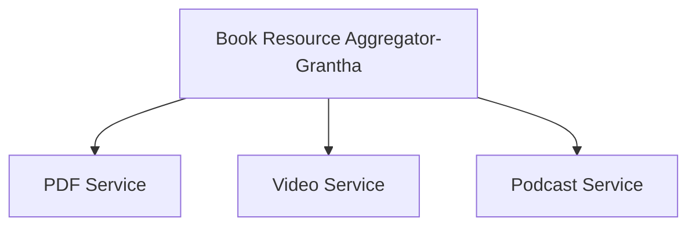

# Prerequisites and Installation Steps 

## Technologies & Tools Used

| Software             | Version Used       | Installation Link |
|----------------------|-------------------|------------------|
| **Spring Initializr** | Latest (2025)      | [🔗 Spring Initializr](https://start.spring.io/) |
| **IntelliJ IDEA**    | 2024.1 (Community/Ultimate) | [🔗 Download IntelliJ](https://www.jetbrains.com/idea/download/) |
| **VS Code**          | 1.87 (March 2025)  | [🔗 Download VS Code](https://code.visualstudio.com/) |
| **React.js**         | 18.2.0             | [🔗 React Docs](https://react.dev/) |
| **Node.js** (for React) | 18.19.0           | [🔗 Download Node.js](https://nodejs.org/) |
| **Postman**          | 11.0.0 (2025)      | [🔗 Download Postman](https://www.postman.com/downloads/) |
| **PostgreSQL**       | 15.6               | [🔗 Download PostgreSQL](https://www.postgresql.org/download/) |

## Installation steps for Backend :
Step 1 : This project uses SpringBoot (a Java framework). Use Spring Initializer to generate a Springboot project.
Select the following 
Project : Maven
Language : Java
SpringBoot : 3.4.4
Enter metadata and add dependencies : Spring Web , Spring Data JPA , PostgreSQL driver

Step 2 : Extract and open the generated zip file through IntelliJ IDE.

Step 3 : Start Building and check responses from server through postman ! 

Make sure to maintain packages for each service in an organized way- for easy imports 😱

## Installation steps for Frontend :

Step 1: Install Node.js and Create React App
npx create-react-app grantha-frontend

Step 2: Open the Project in VS Code

Step 3: Install Required Dependencies
Run the following command :
npm install react-router-dom axios redux react-redux @reduxjs/toolkit react-query tailwindcss @mui/icons-material lucide-react

Step 4: Start the Development Server
Start the React app using: npm start
This will run the frontend on http://localhost:3000/ (or 5432)

### Watch Grantha on your screen now! 😎🚀🔥

#### Which file to run first after you download our code from here ? 
Run the GranthaApplication.java file inside the src/main/java/com/grantha/ package
and write npm start in VsCode terminal for user interface. You can view it on your localhost.

#### Thank you for checking Grantha out !

### Built with endless errors and laughter 💙

### Lipisha and Varada 
### Mtech IT , RVCE Bangalore.
